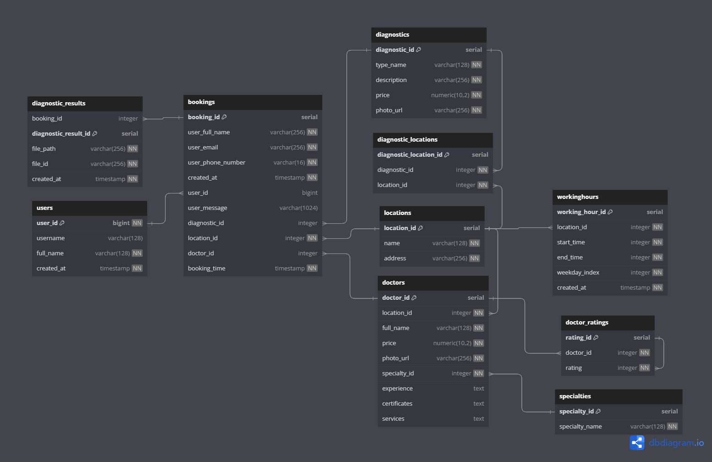

# Database Service: PostgreSQL with Docker

!!! abstract "Overview"
    MedSync's data infrastructure is based on PostgreSQL, a powerful open-source object-relational database system. 

    By leveraging Docker, we can effortlessly initiate the PostgreSQL service, automatically setting up the initial database, roles, and passwords using environment variables.

## Why SQLAlchemy and Alembic?

- [**SQLAlchemy**](https://www.sqlalchemy.org/): This is an ORM (Object-Relational Mapping) library for Python. It allows you to work with databases using Python objects, abstracting away much of the SQL, making database interactions more intuitive and less error-prone.

- [**Alembic**](https://alembic.sqlalchemy.org/en/latest/front.html): Alembic, designed to work with SQLAlchemy, manages database migrations. As your application grows and changes, so too will your database schema. Alembic helps manage these changes, ensuring data integrity.

## Database Diagram: Tables and Relations




### User, Bookings, and Diagnostic Results

```mermaid
erDiagram
    bookings ||..|o diagnostic_results : produces
    users ||..|o bookings : makes
    users ||..|o diagnostic_results : receives
```

In this design:

- A user can make multiple bookings (either with doctors or diagnostics).
- Each booking can produce multiple diagnostic results.
- A user can directly receive multiple diagnostic results.

---

### Doctors, Ratings, and Locations

```mermaid
erDiagram
    doctors ||..|o doctor_ratings : receives
    doctors ||..|| specialties : belongs_to
    doctors ||..|| locations : works_at
    doctors ||..|o bookings : receives
```

Key points:

- Doctors receive ratings from users.
- Every doctor belongs to a specific specialty.
- Doctors work at particular locations.
- Doctors can receive multiple bookings.

---

### Locations, Diagnostic Locations, and Working Hours

```mermaid
erDiagram
    locations ||..|| diagnostic_locations : has
    locations ||..|| workinghours : has
    locations ||..|o bookings : at
```

From the design:

- Locations (clinics) can have multiple diagnostic locations.
- Each location also has designated working hours.
- Bookings can be made at different locations.

---

### Diagnostics and Their Locations

```mermaid
erDiagram
    diagnostics ||..|| diagnostic_locations : has
    diagnostics ||..|o bookings : involves
```

Main points:

- Specific diagnostics are available at certain locations, represented by diagnostic locations.
- Diagnostics can be involved in multiple bookings.


## Deep Dive: Doctors Table

The `Doctors` table, as represented in the SQLAlchemy model:
!!! example
    See full code in [doctors.py](https://github.com/Latand/MedSyncWebApp/blob/main/backend/src/medsyncapp/infrastructure/database/models/doctors.py)

```python
from typing import Optional
from sqlalchemy import Integer, String, ForeignKey, DECIMAL, TEXT
from sqlalchemy.orm import Mapped, mapped_column
from .base import Base, TableNameMixin, TimestampMixin, int_pk

class Doctor(Base, TableNameMixin):
    doctor_id: Mapped[int_pk]
    location_id: Mapped[int] = mapped_column(ForeignKey("locations.location_id"))
    full_name: Mapped[str] = mapped_column(String(128))
    specialty_id: Mapped[int] = mapped_column(ForeignKey("specialties.specialty_id"))
    price: Mapped[float] = mapped_column(DECIMAL(10, 2))
    photo_url: Mapped[str] = mapped_column(String(256))
    experience: Mapped[Optional[str]] = mapped_column(TEXT)
    certificates: Mapped[Optional[str]] = mapped_column(TEXT)
    services: Mapped[Optional[str]] = mapped_column(TEXT)
```

- Here, the `Doctor` class represents the `doctors` table in the database.
  
- Each attribute in the class corresponds to a column in the table. The type and constraints of these columns are defined using SQLAlchemy's API.

## Working with the Data: Requests Repository

The `DoctorRepo` class showcases how the data stored in the `doctors` table can be accessed and manipulated using SQLAlchemy's ORM capabilities:
!!! example
    See full code in [doctors.py](https://github.com/Latand/MedSyncWebApp/blob/main/backend/src/medsyncapp/infrastructure/database/repo/doctors.py)

```python
from sqlalchemy import select
from infrastructure.database.models import (
    Doctor,
    Booking,
    DoctorRating,
    Location,
)
from infrastructure.database.models.doctors import Specialty
from infrastructure.database.repo.base import BaseRepo

class DoctorRepo(BaseRepo):
    async def get_all_doctors(self) -> list[Doctor]:
        stmt = (
            select(
                ...
            )
        )
        result = await self.session.execute(stmt)
        return result.mappings().all()

    async def get_specialties(self) -> list[Specialty]:
        stmt = (
            select(Specialty)
            ...
        )
        result = await self.session.execute(stmt)
        return result.mappings().all()
```

- `DoctorRepo` contains methods that fetch all doctors and their specialties.
  
- These methods utilize the `select` function from SQLAlchemy to create a SQL SELECT statement.


After that, we import and use the `DoctorRepo` as a property of the `RequestsRepo` class:

!!! example
    See full code in [requests.py](https://github.com/Latand/MedSyncWebApp/blob/main/backend/src/medsyncapp/infrastructure/database/repo/requests.py)

```python hl_lines="15-17"
@dataclass
class RequestsRepo:
    """
    Repository for handling database operations. This class holds all the repositories for the database models.

    You can add more repositories as properties to this class, so they will be easily accessible.
    """

    session: AsyncSession

    @property
    def users(self) -> UserRepo:
        return UserRepo(self.session)

    @property
    def doctors(self) -> DoctorRepo:
        return DoctorRepo(self.session)

#     other repos...


```